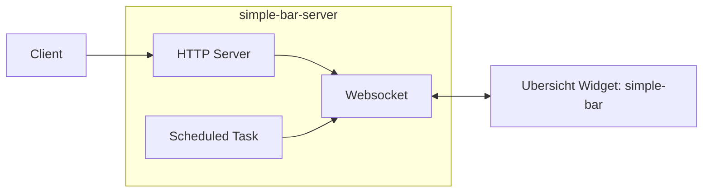

# 

## Overview

This is the server part of [https://github.com/nguymin4/simple-bar](https://github.com/nguymin4/simple-bar)

Architecture diagram:


## Features

- Refresh, toggle, enable or disable simple-bar widgets
- Refresh AeroSpace spaces, windows and displays simple-bar widgets


## Installation

Clone this project to `~/.config/uebersicht`. This is important as currently we need to use python script to get app badges

```bash
git clone https://github.com/nguymin4/simple-bar-server-go.git ~/.config/uebersicht/
```

```
go run .
```

The process named `simple-bar-server`, this can be checked via `ps`, `pgrep` etc.
